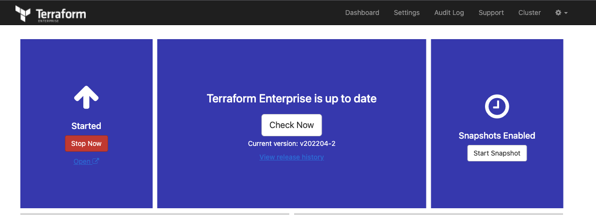

# Terraform Enterprise with agents

The basis of this repository is based on the TFE airgap repository found [here](https://github.com/munnep/TFE_airgap)


With this repository you will be able to do a TFE (Terraform Enterprise) airgap installation on AWS with external services for storage in the form of S3 and PostgreSQL. Additionally there will be a Autoscaling group with agents

The Terraform code will do the following steps

- Create S3 buckets used for TFE
- Upload the necessary software/files for the TFE airgap installation to an S3 bucket
- Generate TLS certificates with Let's Encrypt to be used by TFE
- Create a VPC network with subnets, security groups, internet gateway
- Create a RDS PostgreSQL to be used by TFE
- Create a EC2 instance on which the TFE airgap installation will be performed
- Create an EC2 instance on which a Terraform client is installed that you can use to run your code
- An autoscaling group with agents

# Diagram

  

# Prerequisites

## License
Make sure you have a TFE license available for use

Store this under the directory `files/license.rli`

## Airgap software
Download the `.airgap` file using the information given to you in your setup email and place that file under the directory `./airgap`

Store this for example under the directory `files/610.airgap`

## Installer Bootstrap
[Download the installer bootstrapper](https://install.terraform.io/files/latest.tar.gz)

Store this under the directory `files/replicated.tar.gz`

## AWS
We will be using AWS. Make sure you have the following
- AWS account  
- Install AWS cli [See documentation](https://docs.aws.amazon.com/cli/latest/userguide/install-cliv2.html)

## Install terraform  
See the following documentation [How to install Terraform](https://learn.hashicorp.com/tutorials/terraform/install-cli)

## TLS certificate
You need to have valid TLS certificates that can be used with the DNS name you will be using to contact the TFE instance.  
  
The repo assumes you have no certificates and want to create them using Let's Encrypt and that your DNS domain is managed under AWS. 


# How to

- Clone the repository to your local machine
```
git clone https://github.com/munnep/tfe_aws_agents.git
```
- Go to the directory
```
cd tfe_aws_agents
```
- Set your AWS credentials
```
export AWS_ACCESS_KEY_ID=
export AWS_SECRET_ACCESS_KEY=
export AWS_SESSION_TOKEN=
```
- Store the files needed for the TFE Airgap installation under the `./files` directory, See the notes [here](./files/README.md)
- create a file called `variables.auto.tfvars` with the following contents and your own values
```
tag_prefix               = "patrick-agents"                          # TAG prefix for names to easily find your AWS resources
region                   = "eu-north-1"                               # Region to create the environment
vpc_cidr                 = "10.234.0.0/16"                            # subnet mask that can be used 
ami                      = "ami-09f0506c9ef0fb473"                    # AMI of the Ubuntu image  
rds_password             = "Password#1"                               # password used for the RDS environment
filename_airgap          = "652.airgap"                               # filename of your airgap software stored under ./airgap
filename_license         = "license.rli"                              # filename of your TFE license stored under ./airgap
filename_bootstrap       = "replicated.tar.gz"                        # filename of the bootstrap installer stored under ./airgap
dns_hostname             = "patrick-tfe6"                             # DNS hostname for the TFE
dns_zonename             = "bg.hashicorp-success.com"                 # DNS zone name to be used
tfe_password             = "Password#1"                               # TFE password for the dashboard and encryption of the data
certificate_email        = "patrick.munne@hashicorp.com"              # Your email address used by TLS certificate registration
terraform_client_version = "1.1.7"                                    # Terraform version you want to have installed on the client machine
public_key               = "ssh-rsa AAAAB3Nza"                        # The public key for you to connect to the server over SSH
```
- Terraform initialize
```
terraform init
```
- Terraform plan
```
terraform plan
```
- Terraform apply
```
terraform apply
```
- Terraform output should create 40 resources and show you the public dns string you can use to connect to the TFE instance
```
Apply complete! Resources: 40 added, 0 changed, 0 destroyed.

Outputs:

ssh_tf_client = "ssh ubuntu@patrick-tfe6-client.bg.hashicorp-success.com"
ssh_tfe_server = "ssh ubuntu@patrick-tfe6.bg.hashicorp-success.com"
tfe_appplication = "https://patrick-tfe6.bg.hashicorp-success.com"
tfe_dashboard = "https://patrick-tfe6.bg.hashicorp-success.com:8800"
```
- Connect to the TFE dashboard. This could take 10 minutes before fully functioning
   
- Click on the open button to create your organization and workspaces


# TODO

- [] build network according to the diagram
- [] use standard ubuntu 
- [] Create an AWS RDS PostgreSQL
- [] create a virtual machine in a public network with public IP address.
    - [] firewall inbound are all from user building external ip
    - [] firewall outbound rules
          postgresql rds
          AWS bucket
          user building external ip
- [] Create an AWS bucket
- [] create an elastic IP to attach to the instance
- [] transfer files to TFE virtual machine
      - airgap software
      - license
      - TLS certificates
      - Download the installer bootstrapper
- [] install TFE
- [] Create a valid certificate to use 
- [] Get an Airgap software download
- [] point dns name to public ip address
- [] create an auto scaling group with agents

# Done


# notes and links
[EC2 AWS bucket access](https://aws.amazon.com/premiumsupport/knowledge-center/ec2-instance-access-s3-bucket/)


